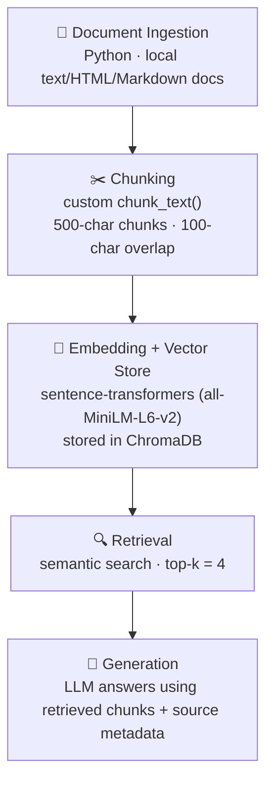

# Project 1 Planning: The Unofficial Guide

> Write this document before you write any pipeline code.
> Your spec and architecture diagram are what you'll use to direct AI tools (Claude, Copilot, etc.) to generate your implementation — the more specific they are, the more useful the generated code will be.
> Update the Retrieval Approach and Chunking Strategy sections if you change your approach during implementation.
> Update this file before starting any stretch features.

---

## Domain

chose the domain beginner’s guide to ordering matcha at specialty tea cafes. This domain focuses on helping people who are new to matcha understand how to order matcha drinks from modern tea shops, boba cafes, and specialty drink shops.

This knowledge is valuable because matcha cafe menus can be confusing for beginners. Menus often include terms like matcha latte, cloud matcha, salted cheese, jasmine matcha, ceremonial matcha, culinary matcha, sweetness level, and milk alternatives without explaining what they actually mean.

---

## Documents

| # | Source | Type | URL or file path |
|---|--------|------|-----------------|
| 1 | Molly Tea Menu | Official cafe menu | https://www.mollytea.co.th/en/menu/ |
| 2 | Molly Tea Bellevue Delivery Menu | Delivery menu / item descriptions | https://www.grubhub.com/restaurant/molly-tea-bellevue-103-bellevue-way-northeast-bellevue/13106344 |
| 3 | Molly Tea San Gabriel Delivery Menu | Delivery menu / item descriptions | https://www.grubhub.com/restaurant/molly-tea-425-w-valley-blvd-san-gabriel/12261624 |
| 4 | HEYTEA Cloud Matcha Latte Menu Page | Menu page / drink details | https://theheyteamenu.us/cloud-matcha-latte/ |
| 5 | HEYTEA Supreme Matcha Latte Menu Page | Menu page / drink details | https://theheyteamenu.us/supreme-matcha-latte/ |
| 6 | Reddit r/MatchaEverything: HEYTEA’s matcha discussion | Forum discussion / customer opinions | https://www.reddit.com/r/MatchaEverything/comments/1las3u9/i_might_get_roasted_for_this_but_i_think_heyteas/ |
| 7 | Reddit r/bubbletea: HEYTEA favorite bubble tea spot discussion | Forum discussion / customer opinions | https://www.reddit.com/r/bubbletea/comments/1kz2jgp/heytea_is_my_favorite_bubble_tea_spot_whats_yours/ |
| 8 | Reddit r/MatchaEverything: Sweet tasting matcha powders for beginners | Forum discussion / beginner matcha opinions | https://www.reddit.com/r/MatchaEverything/comments/1j9bw6b/sweet_tasting_matcha_powders_for_beginners/ |
| 9 | Food & Wine: Ceremonial Grade Matcha Doesn’t Actually Exist in Japan | Article / matcha quality explanation | https://www.foodandwine.com/ceremonial-vs-culinary-matcha-8641415 |
| 10 | Ikimatcha: Which Matcha to Buy? Ceremonial vs Culinary | Article / matcha grade guide | https://ikimatcha.co/blogs/news/which-matcha-to-buy |

---

## Chunking Strategy

**Chunk size:**
I will split my documents into chunks of about 500 characters with an overlap of about 100 characters. This chunk size fits my documents because my corpus includes a mix of short menu descriptions, short reviews, Reddit comments, and longer educational articles. A smaller chunk size helps keep each retrieved chunk focused on one drink, one opinion, or one matcha concept.

**Overlap:**
The 100-character overlap helps because some useful information may span across two chunks. For example, one sentence might describe a drink’s ingredients, while the next sentence explains its flavor or whether it is beginner-friendly. The overlap increases the chance that a retrieved chunk still contains enough context to be useful.

**Reasoning:**
If my chunks are too small, the system might retrieve fragments that do not fully answer the question. For example, it might retrieve only “salted cheese topping” without explaining whether it makes the drink sweeter, creamier, or better for beginners. If my chunks are too large, the system might retrieve too much unrelated information at once, such as multiple drinks or multiple opinions in one chunk, making it harder for the LLM to give a focused answer. Bad retrieval results would look like answers that are too vague, mix up drinks, or cite chunks that only partially relate to the question.

---

## Retrieval Approach

**Embedding model:**
I plan to use all-MiniLM-L6-v2 through sentence-transformers as my embedding model. I will retrieve the top 4 chunks per query. Four chunks should give the LLM enough context to compare multiple sources without overwhelming it with too much unrelated text.

**Top-k:**
Retrieving 4 chunks should give the LLM enough information to answer with context from multiple sources without including too much unrelated text. If I retrieve too few chunks, the system might miss useful information or rely on only one source. For example, a question about beginner-friendly matcha might need information from both a matcha education article and customer opinions. If I retrieve too many chunks, the context could become noisy and include unrelated drinks, general boba opinions, or off-topic comments.

**Production tradeoff reflection:**
If I were deploying this for real users and cost was not a constraint, I would consider a stronger embedding model with better accuracy, longer context length, and better support for informal language. Since some documents may include Reddit comments, menu terms, or non-English tea names, I would also consider multilingual support and domain-specific accuracy. The tradeoff is that larger embedding models can be slower and more expensive.

---

## Evaluation Plan

| # | Question | Expected answer |
|---|----------|-----------------|
| 1 | What type of matcha drink would be best for a beginner who does not want something too bitter? | A matcha latte or a sweeter milk-based matcha drink would be best because milk and sweetness can make the matcha flavor smoother and less bitter. |
| 2 | What customizations can make a matcha drink taste sweeter or creamier? | Adding sweetness, choosing a creamy milk like oat milk, ordering a latte-style drink, or adding cream/foam toppings can make the drink sweeter or creamier. |
| 3 | What is the difference between ceremonial and culinary matcha? | Ceremonial matcha is usually marketed as higher quality and better for drinking plain, while culinary matcha is usually used for lattes, baking, or mixing. However, the labels can be inconsistent, so beginners should not rely only on those terms. |
| 4 | What is the difference between a Cloud Matcha and a regular matcha latte? | A Cloud Matcha is a matcha latte topped with a layer of salted cheese foam, which adds a creamy, slightly savory layer that balances the matcha's bitterness. A regular matcha latte is stone-ground matcha shaken with fresh milk at a chosen sweetness level. The Cloud version is often considered more approachable for first-timers because the foam softens the flavor. |
| 5 | What should someone order if they want a stronger matcha flavor? | They should choose a drink where matcha is the main focus, use less sugar, avoid too many toppings or fruit flavors, and avoid drinks where milk or cream overpowers the matcha. |

> **Revision note (evaluation stage):** Question 4 originally asked "Why are Reddit discussions and customer reviews useful for this guide?" During evaluation I found this was a *methodology* question about the project itself, not a question my content corpus could answer — retrieval returned only weakly-related chunks (cosine distance ~0.9) and the system correctly refused. I replaced it with a content question that exercises my stated risk of confusing similar drinks, so the question is answerable from the documents and the result is meaningful evidence.

---

## Anticipated Challenges

1. One risk is noisy or inconsistent documents because many sources are based on customer opinions, Reddit comments, or reviews. Different people may describe the same matcha drink differently depending on their taste preferences. For example, one person may say a drink is too bitter while another person may say it is smooth and balanced. This could make it harder for the system to give one clear answer.

2. Another risk is off-topic retrieval or poor chunking. Some cafe menus and discussion threads may include non-matcha drinks, general boba drinks, or unrelated cafe opinions. If the chunks are too large or split badly, the system might retrieve information about the wrong drink or miss important context, such as the drink name, ingredients, or whether the drink is beginner-friendly.

---

## Architecture

The "Unofficial Guide to Ordering Matcha" is built as a Retrieval-Augmented Generation (RAG) pipeline. A user question flows through five stages, from ingesting source documents to generating a grounded answer:

---

## AI Tool Plan

1. I plan to use Claude as a brainstorming and feedback tool by giving it my planning sections and asking it to point out unclear parts or weaknesses. I will compare its suggestions with the assignment requirements before deciding what to change.

2. I plan to use Claude to refine my writing by giving it rough drafts of my Domain, Chunking Strategy, Retrieval Approach, and Evaluation Plan sections. I will make sure the revised wording still reflects my own project choices.

3. I plan to use Claude to help implement my `chunk_text()` function by giving it my chunk size, overlap size, and document types. I will test the function myself to check that chunks are readable and keep important context together.

4. I plan to use Claude to review retrieval results by giving it a test question, the retrieved chunks, and my retrieval settings. I will use the conversation to reason through whether the results are relevant instead of accepting its feedback automatically.

5. I plan to use Claude to improve my evaluation questions by asking whether each question is specific and testable. I will verify that each final question can be answered using my collected documents.

6. Overall, I will use Claude thoughtfully as a support tool, not as a replacement for my own decisions. I will combine its feedback with my own judgment and the project instructions before submitting anything.

**Milestone 3 — Ingestion and chunking:** I gave Claude my Chunking Strategy section and document types and asked it to implement `chunk_text()`. It produced a sliding-window chunker (500 characters, 100 overlap) that snaps chunk boundaries to paragraph/sentence breaks, plus a cleaning step (HTML/entity/boilerplate removal) and an inspection step with warnings. I verified the output by reading representative and random chunks before accepting the parameters.

**Milestone 4 — Embedding and retrieval:** I used `all-MiniLM-L6-v2` with ChromaDB and top-k = 4. Claude flagged that ChromaDB defaults to L2 distance, which would not match my planned 0.5/0.6/0.7 relevance thresholds, so I configured cosine distance instead. I tested retrieval on the evaluation questions and confirmed relevant chunks ranked first at low distances.

**Milestone 5 — Generation and interface:** I connected retrieval to Groq `llama-3.3-70b-versatile` with a strict grounding prompt and built a Gradio UI. Adding Gradio 6.x forced an upgrade of the embedding stack (sentence-transformers/transformers); I verified retrieval distances were unchanged before keeping it. I tested grounding with an off-topic question and confirmed the system refuses instead of hallucinating.
